# Smart Workforce Analytics & HR Decision Support System

## Project Overview

Smart Workforce Analytics is an HR analytics and decision support system designed to analyze employee attendance, leave patterns, salary deductions, and employee performance.

The system helps HR teams understand workforce behavior through an interactive dashboard and automated Excel/PDF reports.

---

# Objectives

- Analyze employee attendance patterns
- Identify frequent late arrivals
- Calculate salary deductions based on leave records
- Evaluate employee performance
- Provide HR insights through visualization
- Generate automated analytical reports

---

# Technologies Used

- Python
- Pandas
- Matplotlib
- Streamlit
- OpenPyXL
- ReportLab

---

# Project Features

## 1. Dataset Generation

Creates realistic HR datasets including:

- Employee details
- Attendance records
- Leave records
- Salary information


## 2. Data Cleaning

The system performs:

- Missing value checking
- Data validation
- Duplicate checking
- Dataset preparation


## 3. Attendance Analysis

Includes:

- Attendance percentage calculation
- Present and absent analysis
- Late arrival tracking
- Working hour analysis


## 4. Leave Analysis

Provides:

- Leave utilization analysis
- Paid leave tracking
- Extra leave identification


## 5. Salary Analysis

Includes:

- Gross salary calculation
- Salary deduction calculation
- Net salary generation


## 6. Employee Performance Analysis

Performance score is calculated using:

- Attendance percentage
- Average working hours
- Late arrival frequency

The system identifies top-performing employees.


## 7. Interactive Dashboard

The Streamlit dashboard displays:

- Total employees
- Present today
- Absent today
- Total late arrivals
- Average working hours
- Attendance percentage
- Paid leave usage
- Salary deductions
- Employee details
- Top performers
- Attendance trends
- Department comparison
- Leave utilization


## 8. Report Generation

The system automatically generates:

- Excel Report
- PDF Report


---

# Dashboard Screenshots


## Workforce Overview

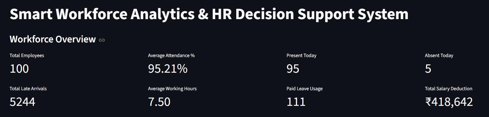


## Employee Details

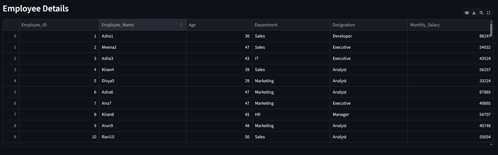


## Attendance Analysis

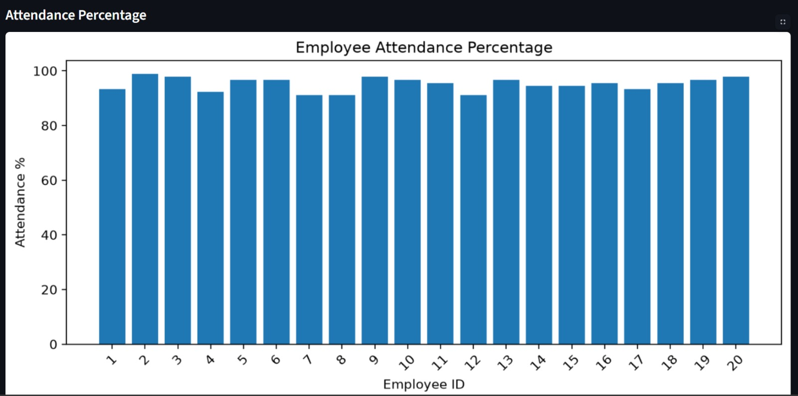
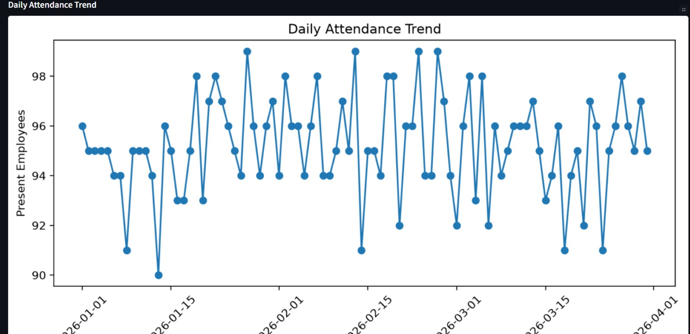
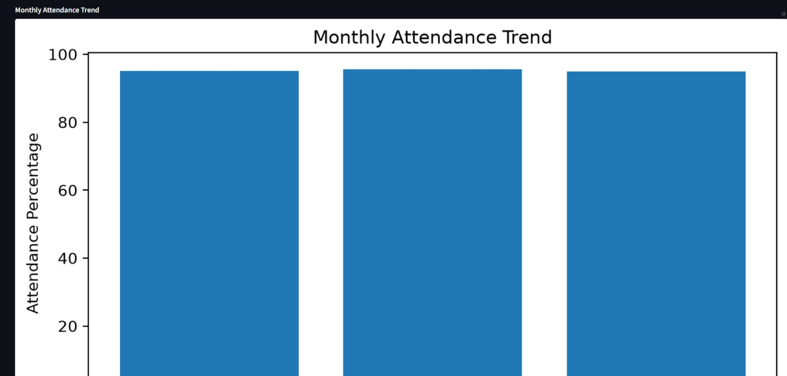


## Performance Analysis

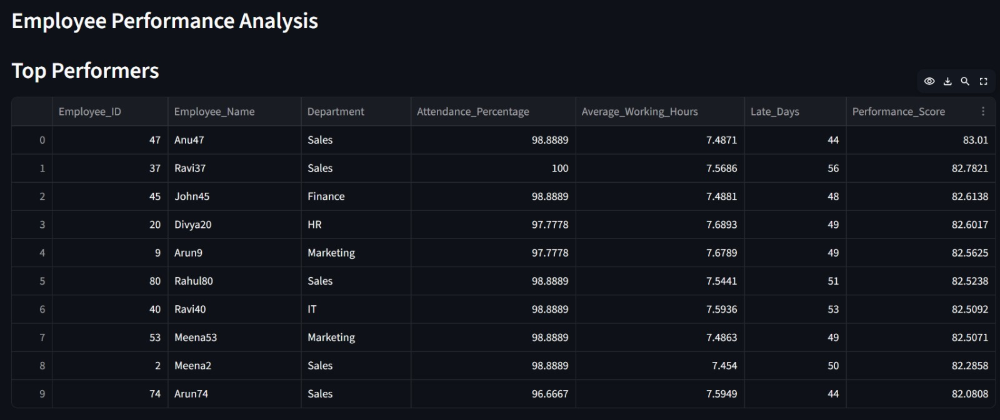
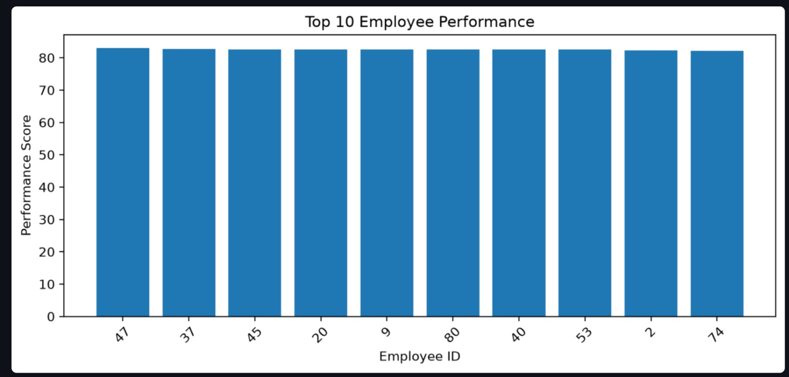


## Department Analysis

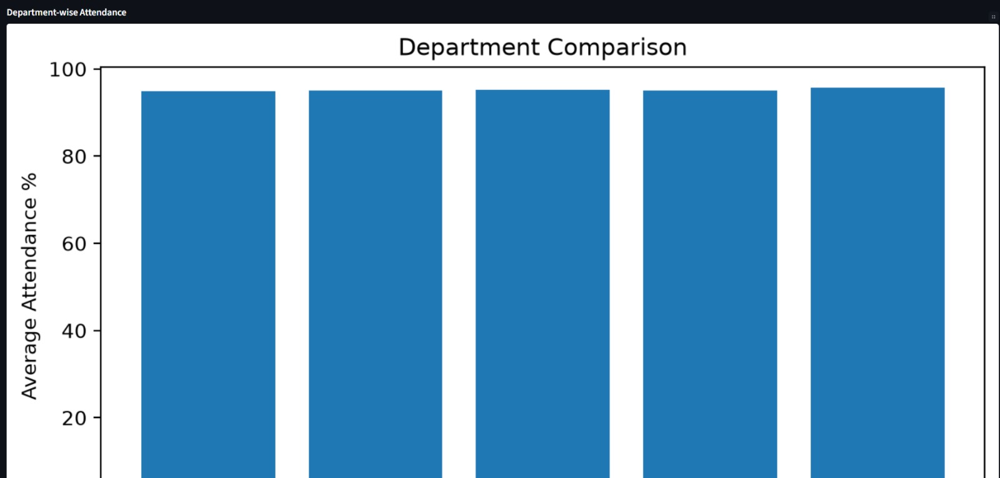
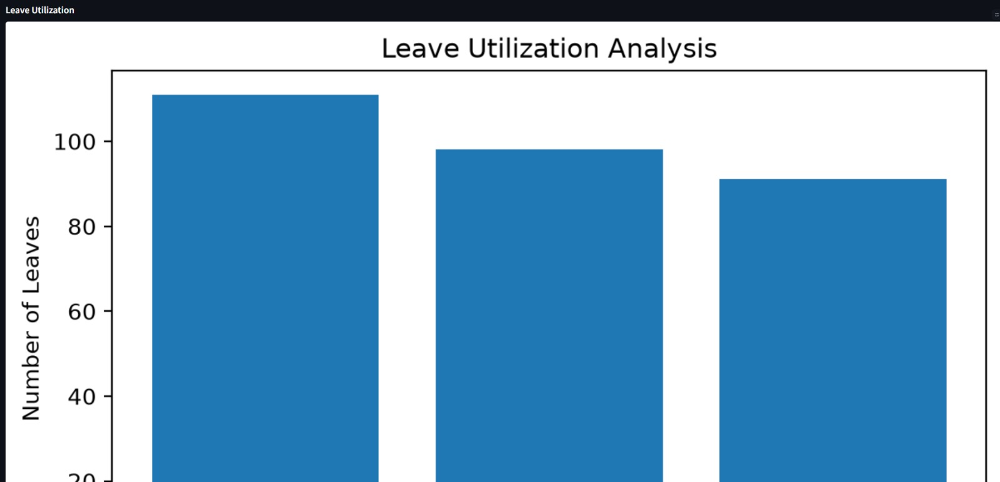


## Salary Analysis

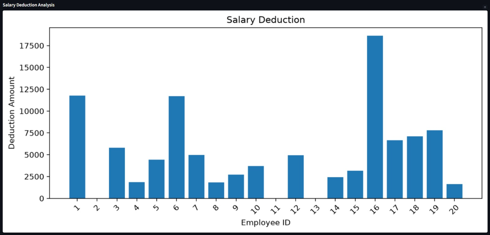
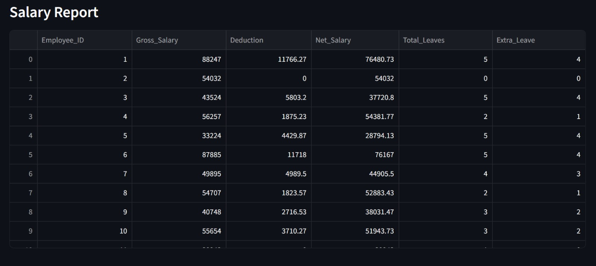


---

# Project Structure

Smart-Workforce-Analytics

│
├── analysis
│ ├── generate_dataset.py
│ ├── data_cleaning.py
│ ├── hr_analysis.py
│ ├── hr_data_check.py
│ ├── export_report.py
│ └── export_pdf.py
│
├── dashboard
│ └── dashboard.py
│
├── dataset
│
├── exports
│ ├── HR_Analytics_Report.xlsx
│ └── HR_Analytics_Report.pdf
│
├── reports
│ └── screenshots
│
└── requirements.txt


---

# How to Run the Project

## Install Required Libraries

```bash
pip install -r requirements.txt


Generate Dataset

python analysis/generate_dataset.py


Clean Dataset

python analysis/data_cleaning.py


Perform Analysis

python analysis/hr_analysis.py


Generate Reports

Excel:

python analysis/export_report.py

PDF:

python analysis/export_pdf.py


Launch Dashboard

python -m streamlit run dashboard/dashboard.py


Output Files

Generated reports:

HR_Analytics_Report.xlsx
HR_Analytics_Report.pdf


## Future Enhancements

- Replace the sample dataset with live attendance data from an employee attendance application.
- Integrate Firebase or another database for real-time employee information storage.
- Enable automatic dashboard updates whenever new attendance records are added.
- Implement real-time HR monitoring and analytics.
- Add predictive analytics for employee performance and attendance trends.


Conclusion

Smart Workforce Analytics provides an effective HR decision support solution by combining data processing, analytics, visualization, and automated reporting.

The system enables HR teams to make data-driven decisions regarding attendance management, employee performance, and workforce planning.